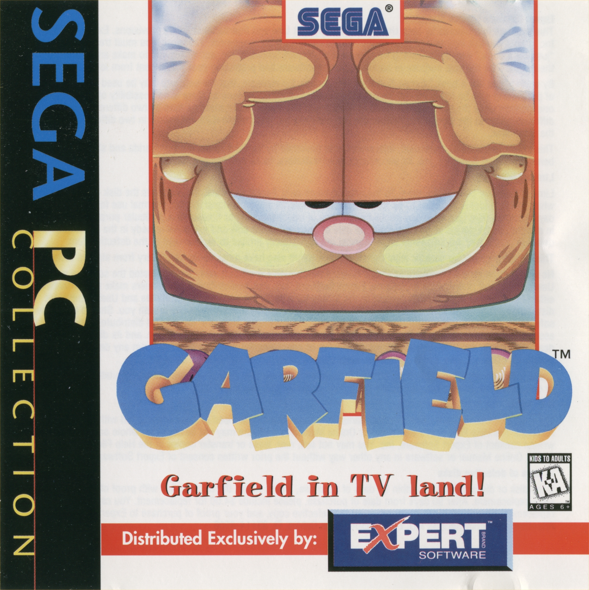

# Garfield: Caught in the Act (PC) – Fully Functional Windows 10/11 Setup (CD Audio Fixed)

This archive preserves a fully working setup of Garfield: Caught in the Act for modern systems, including Windows 10/11.

Music has been restored using a CD audio emulation layer (WAV/MP3 supported depending on configuration). No VM required.

## Story:

Garfield: Caught in the Act on PC relies heavily on CD Audio (CDDA) for its soundtrack. On modern systems, this results in missing or completely silent music, breaking the original experience.

This archive was created to preserve a fully functional version of the game with restored audio playback.

The fix was achieved by redirecting CD audio calls through a WinMM-based wrapper and mapping original CD tracks into a modern audio format (WAV/MP3/OGG depending on configuration).

After this fix, the game runs as originally intended, with full background music restored.

## Details:

The original PC release is known to have CD audio (CDDA) issues on modern systems, resulting in missing or silent music. This package includes a tested fix that restores full in-game music playback.

## 📦 Contents
Game (Clean Install Folder)
A clean, working installation of the game without modifications.
CD Audio Fix Pack (Music + WinMM Wrapper)
Includes:
Extracted original CD audio tracks converted for compatibility
Working winmm.dll replacement supporting WAV/MP3 playback
Configuration files required for CD audio emulation
System Compatibility File (wing32.dll)
Required legacy DLL for proper execution on modern Windows systems.
(May need placement in System32 / SysWOW64 depending on system architecture)
Original Game Manual (PDF/Scan)
Included for preservation and reference.
https://archive.org/details/Garfield-Caught-in-the-Act-PC-Audio-FIX-Win10-11

## 🛠️ Features
Fully playable on Windows 10 / Windows 11
Restored CD music (no silent audio issues)
No virtual machine required
No DOSBox required
Plug-and-play setup after installation

## ⚠️ Notes
This is intended for preservation and compatibility purposes.
Requires correct placement of included DLLs for full functionality.
Audio fix is based on CDDA emulation using a WinMM wrapper.

## THE JOURNEY OF THIS FIX

This game was preserved and fixed after discovering that Original CD audio tracks were not being properly emulated on modern systems.

The issue was traced to CDDA playback through legacy MCI/WinMM calls, requiring a custom wrapper solution.

This archive represents a fully working restoration of the original experience.
